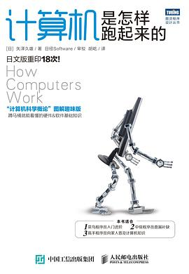

# Kevin 的读书笔记（第 3 期）：

## 序言

> 八月进入了秋天，也是多事之秋。
> 有过自我的挣扎，感受情感的纠缠，外界纷纷扰扰，愿在书中寻找一方净土。
> 来看看我这个月读的一些书和分享吧。
> 

## 计算机是怎样跑起来的（[日] 矢泽久雄）

> 关键词：技术入门读物；计算机
> 推荐值：⭐⭐⭐
> 进度值：100%

我对《怎样》系列这套书感兴趣已久，这个月便安排看了起来，第一本是从底层的《计算机是怎样跑起来的》。相信看到这篇文章的你肯定用过计算机，包括你手上的手机也是计算机，但是又有多少人知道计算机是怎样跑起来的呢？如果你想知道，那这本书可以给你答案。

首先提出也是最重要的便是计算机的三大原则：

1. 计算机是执行输入、运算、输出的机器
2. 程序是指令和数据的集合
3. 计算机的处理方式有时与人们的思维习惯不同

我想如果也是作为程序员的你，对这三点肯定深有体会。虽然这是一本面向大众的技术入门读物，里面的很多内容都比较简单基础，但也有不少内容值得学习思考。

比如在第五章介绍算法中提到的一个提升程序执行速度的编程技巧——“**哨兵**”。这个技巧多用在线性搜索（从若干个数据中查找目标数据）等算法中。线性搜索的基本过程是将若干个数据从头到尾，依次逐个比对，直到找到目标数据。

通过一个例题来讲解吧。假设有 100 个箱子，里面分别装有一个写有任意数字的纸条，箱子上面标有 1 ～ 100 的序号。现在要从这 100 个箱子当中查找是否有箱子装有写着要查找数字的纸条。

首先看看不使用哨兵的方法。从第一个箱子开始依次检查每个箱子中的纸条。每检查完一个纸条，还要再检查箱子的编号（用变量 N 表示），并进一步确认编号是否已超过最后一个编号了。这个过程用流程图表示后如图 307\_未使用哨兵的流程图 所示。

这个过程虽然看起来似乎没什么问题，但是实际上含有不必要的处理——每回都要检查箱子的编号有没有到 100。

**为了消除这种不必要的处理，于是添加了一个 101 号箱子，其中预先放入的纸条上写有正要查找的数字。这种数据就被称为“哨兵”**（可以减少 n 次的判断）。通过放入哨兵，就一定能找到要找的数据了。找到要找的数据后，如果该箱子的编号还没有到 101 就意味着找到了实际的数据；如果该箱子的编号是 101，则意味着找到的是哨兵，而没有找到实际的数据。使用了哨兵的流程图如图 308\_使用了哨兵的流程图 所示。需要多次反复检查的就只剩下“第 N 个箱子中包含要找的数字吗？”这一点了，程序的执行时间也因此大幅度地缩减了。

有些读者会感到“不太明白巧妙在哪里”，那么就讲一个故事来解释哨兵的概念吧。假设某个漆黑的夜晚，诸位在在海岸的悬崖边上玩一个游戏（请勿亲身尝试）。**诸位站在距悬崖边缘 100 米的地方，地上每隔 1 米就任意放 1 件物品。请找出这些物品中有没有苹果。**

诸位每前进 1 米就要捡起地上的物品，检查是否拿到了苹果，同时还要检查有没有到达悬崖的边缘（不检查的话就有可能掉到海里）。也就是说要对这两种检查反复若干次。

使用了哨兵以后，就要先把起点挪到距悬崖边缘 101 米的地方，再在悬崖的边缘放置一个苹果（如图 309\_使用了哨兵的游戏 所示）。这个苹果就是哨兵。通过放置哨兵，诸位就一定能找到苹果了。每前进 1 米时只需检查捡到的物品是不是苹果就可以了。发现是苹果以后，只需站在原地再检查一步开外的情况。如果还没有到达悬崖边缘，就意味着找到了真正要找的苹果。已经达到了悬崖边缘，则说明现在手中的苹果是哨兵，而没有找到真正要找的苹果。

是不是觉得很巧妙？计算机世界还有很多这样细微但绝妙的技巧等着你去发现。

## 结尾

>

## 参考
